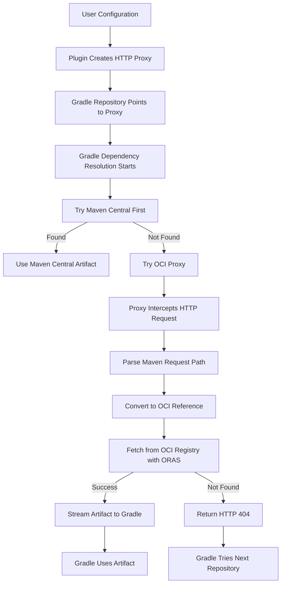

# Maven OCI Registry Plugin

A Gradle plugin that enables **bidirectional** Maven artifact management with OCI-compliant registries using the [ORAS (OCI Registry as Storage)](https://oras.land/) protocol.

## Features

- 📤 **Publish** Maven artifacts to OCI registries
- 📥 **Consume** Maven dependencies from OCI registries  
- 🔄 Seamless integration with existing Gradle repositories
- 📂 Local caching for performance and offline access
- 🔐 Authentication support (username/password)
- 🗂️ Intelligent Maven ↔ OCI coordinate mapping

## Requirements

- **Gradle 6.0+**
- **Java 17+** (required by ORAS Java SDK)
- Network access to OCI registries

## Installation

```gradle
plugins {
    id 'java'
    id 'io.seqera.maven-oci-registry'
}
```

## Syntax Overview

The plugin provides a clean, consistent syntax for both consuming and publishing:

**Dependency Resolution:**

```gradle
repositories {
    mavenOci {
        url = 'https://registry.com/maven'
    }
}
```

**Publishing:**

```gradle
publishing.repositories {
    mavenOci {
        name = 'myRegistry'
        url = 'https://registry.com/maven'
        credentials { ... }
    }
}
```

## Get Started

### 📥 Consuming Dependencies from OCI

Add OCI repositories to your `repositories` block:

```gradle
repositories {
    mavenCentral()  // Fallback for standard dependencies
    
    mavenOci {
        url = 'https://registry.example.com/maven'
    }
}

dependencies {
    implementation 'com.example:my-library:1.0.0'
}
```

### 📤 Publishing to OCI Registries  

Configure publishing with the `mavenOci` extension. You can optionally specify a `name` for clean task names:

```gradle
publishing {
    publications {
        maven(MavenPublication) {
            from components.java
        }
    }
}

publishing {
    publications {
        maven(MavenPublication) {
            from components.java
        }
    }
    
    repositories {
        // Traditional Maven repository
        maven {
            name = 'central'
            url = 'https://repo1.maven.org/maven2/'
        }
        
        // Maven repository over OCI registry
        mavenOci {
            name = 'myRegistry'
            url = 'https://registry.example.com'
            credentials {
                username = 'user'
                password = 'pass'
            }
        }
    }
}
```

Then publish:
```bash
./gradlew publishToOciRegistries
```

## Overwrite Policy Configuration

The plugin provides an `overwritePolicy` option to control behavior when publishing artifacts that already exist in the registry.

### Available Policies

- **`fail`** (default): Fails the build if the package already exists
- **`override`**: Replaces the existing package with the new version  
- **`skip`**: Skips publishing if the package already exists (build continues successfully)

### Configuration

```gradle
publishing {
    repositories {
        mavenOci {
            name = 'myRegistry'
            url = 'https://registry.example.com'
            overwritePolicy = 'skip'  // fail | override | skip
            credentials {
                username = 'user'
                password = 'pass'
            }
        }
    }
}
```

### Policy Behaviors

#### Fail Policy (Default)
```gradle
mavenOci {
    name = 'registry'
    overwritePolicy = 'fail'  // or omit for default
}
```
- **Behavior**: Build fails with clear error message if package exists
- **Use case**: Prevent accidental overwrites in production
- **Output**: `Package already exists in registry: registry.com/namespace/artifact:version. Use overwritePolicy = 'override' to replace it, or overwritePolicy = 'skip' to skip publishing.`

#### Override Policy
```gradle
mavenOci {
    name = 'registry'
    overwritePolicy = 'override'
}
```
- **Behavior**: Replaces existing packages without checking
- **Use case**: Continuous deployment where artifacts should be updated
- **Output**: Package is replaced with new version

#### Skip Policy
```gradle
mavenOci {
    name = 'registry'
    overwritePolicy = 'skip'
}
```
- **Behavior**: Skips publishing if package exists, build continues successfully
- **Use case**: Safe republishing scenarios where duplicates should be ignored
- **Output**: `Package already exists, skipping publication: registry.com/namespace/artifact:version`

## Maven ↔ OCI Coordinate Mapping and Resolution

The Maven OCI Registry Plugin enables storing and retrieving Maven artifacts in OCI (Open Container Initiative) registries using the ORAS (OCI Registry as Storage) protocol. This requires a systematic mapping between Maven's coordinate system and OCI's naming conventions.

### Coordinate Mapping

Maven uses a three-part coordinate system:
```
groupId:artifactId:version
```

For example:
- `com.example:my-library:1.0.0`
- `org.springframework:spring-core:5.3.21`
- `io.seqera.nextflow:nextflow-core:22.04.0`

OCI registries use a hierarchical naming system:
```
registry.com/namespace/repository:tag
```

### Mapping Algorithm

The plugin maps Maven coordinates to OCI references using the following algorithm:

1. **Registry Base**: Use the configured registry URL as the base
2. **Group Sanitization**: Transform the Maven `groupId` to be OCI-compliant
3. **Repository Path**: Combine sanitized group and `artifactId`
4. **Tag**: Use the Maven `version` as the OCI tag

#### Complete Mapping Formula
```
Maven: groupId:artifactId:version
OCI:   registry.com/[namespace/]sanitized-groupId/artifactId:version
```

### Group ID Sanitization Rules

Maven group IDs often contain characters that are not valid in OCI repository names. The sanitization process applies these transformations:

1. **Case Normalization**: Convert to lowercase
   - `Com.Example` → `com.example`

2. **Dot Replacement**: Replace dots with hyphens for Docker compatibility
   - `com.example` → `com-example`

3. **Invalid Character Removal**: Keep only alphanumeric, dots, hyphens, underscores
   - `com.example@version` → `com-exampleversion`
   - `group/with/slashes` → `groupwithslashes`

4. **Separator Consolidation**: Replace consecutive separators with single hyphens
   - `com..example` → `com-example`
   - `mixed.-._.separators` → `mixed-separators`

5. **Trimming**: Remove leading and trailing separators
   - `.com.example.` → `com-example`

6. **Safety Prefix**: Add "g" prefix if result starts with hyphen or underscore (handled by cleanup)
   - `-example` → `example` (separators are removed)

### Mapping Examples

| Maven Coordinate | Sanitized Group | OCI Reference |
|------------------|-----------------|---------------|
| `com.example:my-lib:1.0.0` | `com-example` | `registry.com/com-example/my-lib:1.0.0` |
| `org.springframework:spring-core:5.3.21` | `org-springframework` | `registry.com/org-springframework/spring-core:5.3.21` |
| `io.seqera.nextflow:nextflow-core:22.04.0` | `io-seqera-nextflow` | `registry.com/io-seqera-nextflow/nextflow-core:22.04.0` |
| `Com.EXAMPLE.Test:artifact:1.0` | `com-example-test` | `registry.com/com-example-test/artifact:1.0` |
| `com.fasterxml.jackson.core:jackson-core:2.13.0` | `com-fasterxml-jackson-core` | `registry.com/com-fasterxml-jackson-core/jackson-core:2.13.0` |

### Namespace Support

OCI registries often use namespaces to organize repositories. The plugin supports multiple namespace levels embedded in the registry URL:

**URL Path Namespace**: Supports unlimited nested namespace levels
```gradle
mavenOci {
    url = 'https://registry.com/org/team/maven'
}
```
Result: `registry.com/org/team/maven/sanitized-group/artifact:version`

**Examples of supported namespace patterns:**
- `https://registry.com` → No namespace (root level)
- `https://registry.com/maven` → Single namespace level  
- `https://registry.com/org/maven/snapshots` → Multiple namespace levels
- `https://ghcr.io/myorg/maven` → GitHub Container Registry with namespace

For publishing, you can also configure namespace separately:
```gradle
publishing {
    repositories {
        mavenOci {
            name = 'docker'
            url = 'https://registry.com'
            namespace = 'org/team/maven'
        }
    }
}
```

## Resolution Architecture: HTTP Proxy Approach

The Maven OCI Registry Plugin uses an **HTTP proxy architecture** that provides efficient dependency resolution while maintaining full compatibility with Gradle's dependency resolution system.

### Core Architecture

The plugin creates a **local HTTP proxy server** that mimics Maven repository structure and handles OCI resolution **on-demand** only when Gradle actually requests artifacts.



### Repository Order Benefits

The HTTP proxy approach ensures proper repository ordering:

| Scenario | Resolution Flow |
|----------|----------------|
| `org.slf4j:slf4j-api:2.0.7` | 1. Try Maven Central (success)<br>**STOP** - no OCI call needed |
| `com.example:my-lib:1.0.0` | 1. Try Maven Central (fail)<br>2. Try OCI (success) |

### Detailed Resolution Flow

#### 1. **Proxy Server Startup**
When you configure `mavenOci { url = 'https://registry.com' }`:
- Plugin starts local HTTP server on `http://localhost:RANDOM_PORT/maven/`
- Maven repository is configured to point to this proxy URL
- Works naturally with Gradle's resolution order

#### 2. **Request Interception**
When Gradle makes HTTP requests like:
```
GET http://localhost:8543/maven/com/example/my-lib/1.0.0/my-lib-1.0.0.jar
```

The proxy:
- Parses the Maven coordinate: `com.example:my-lib:1.0.0`
- Converts to OCI reference: `registry.com/com-example/my-lib:1.0.0`
- Uses ORAS Java SDK to fetch from OCI registry **on-demand**

#### 3. **Artifact Streaming**
- Downloads artifacts to temporary directory
- Streams artifact bytes directly back via HTTP response
- Sets appropriate `Content-Type` headers
- Caches in-memory for build session (optional)

#### 4. **Error Handling**
- **Artifact not found in OCI**: Returns HTTP 404, Gradle continues to next repository
- **Network failure**: Returns HTTP 500, Gradle continues to next repository  
- **Invalid request**: Returns HTTP 400, request rejected

### Performance Benefits

✅ **True Lazy Resolution**: Only resolves artifacts when Gradle actually requests them  
✅ **Repository Order Respect**: No unnecessary OCI calls for Maven Central artifacts  
✅ **Network Efficiency**: Dramatic reduction in network calls for mixed dependency trees  
✅ **Memory Efficiency**: No persistent cache directories to manage  
✅ **Build Speed**: Faster builds, especially for projects with many standard dependencies  

### Request Flow Examples

#### Example 1: Standard Dependency (slf4j-api)
```bash
repositories {
    mavenCentral()                    # Checked FIRST
    mavenOci { url = '...' }         # Only if needed
}

dependencies {
    implementation 'org.slf4j:slf4j-api:2.0.7'
}
```

**Resolution:**
1. Gradle tries Maven Central → **FOUND** ✅
2. **Proxy never called** → Zero unnecessary OCI network calls

#### Example 2: OCI Dependency (my-lib)  
```bash
dependencies {
    implementation 'com.example:my-lib:1.0.0'
}
```

**Resolution:**
1. Gradle tries Maven Central → **404 Not Found**
2. Gradle tries OCI proxy → **GET http://localhost:8543/maven/...**
3. Proxy converts to OCI: `registry.com/com-example/my-lib:1.0.0`
4. ORAS SDK fetches artifact → **HTTP 200 + JAR bytes**

### Lifecycle Management

The proxy server is automatically managed:

- **Startup**: Dynamic port allocation avoids conflicts
- **Runtime**: Thread-safe concurrent request handling  
- **Session Caching**: Optional in-memory cache for repeated requests
- **Shutdown**: Automatic cleanup when Gradle build finishes

## Plugin Tasks

The plugin creates the following tasks:

### Publishing Tasks
- `publishToOciRegistries` - Publishes all publications to all OCI repositories
- `publish<Publication>To<Repository>Repository` - Publishes specific publication to specific repository
  - Example: `publishMavenPublicationToMyRegistryRepository`

### Standard Gradle Tasks
The plugin integrates with standard Gradle publishing:
- `publish` - Publishes to all configured repositories (Maven + OCI)
- `publishToMavenLocal` - Local Maven repository publishing
- All standard `maven-publish` plugin tasks

## Authentication

### Username/Password
```gradle
mavenOci {
    name = 'registry'
    url = 'https://registry.example.com'
    credentials {
        username = 'user'
        password = 'password'
    }
}
```

### Environment Variables
```gradle
mavenOci {
    name = 'registry'
    url = 'https://registry.example.com'
    credentials {
        username = System.getenv('REGISTRY_USERNAME')
        password = System.getenv('REGISTRY_PASSWORD')
    }
}
```

## Advanced Configuration

### Insecure Registries (HTTP)
```gradle
mavenOci {
    url = 'http://localhost:5000'
    insecure = true
}
```

### Multiple Registries
```gradle
repositories {
    mavenOci {
        url = 'https://internal.company.com/maven'
        credentials { /* ... */ }
    }
    
    mavenOci {
        url = 'https://public.registry.com/maven'
    }
    
    mavenCentral()  // Fallback
}
```

### Custom Namespace
```gradle
publishing {
    repositories {
        mavenOci {
            name = 'custom'
            url = 'https://registry.com'
            namespace = 'my-org/maven-artifacts'
        }
    }
}
```

## Configuration Examples

### Consumer Configuration

```gradle
repositories {
    mavenCentral()
    
    // Public OCI registry
    mavenOci {
        url = 'https://public.cr.seqera.io/maven'
    }
    
    // Private registry with authentication
    mavenOci {
        url = 'https://registry.company.com/maven'
        credentials {
            username = project.findProperty('registryUser')
            password = project.findProperty('registryPass')
        }
    }
    
    // Local development registry
    mavenOci {
        url = 'http://localhost:5000'
        insecure = true
    }
}

dependencies {
    implementation 'com.company:internal-lib:1.0.0'  // Tries OCI first
    implementation 'org.springframework:spring-core:5.3.21'  // Falls back to Maven Central
}
```

### Publisher Configuration

```gradle
publishing {
    publications {
        maven(MavenPublication) {
            from components.java
        }
    }
    
    repositories {
        mavenOci {
            name = 'dockerHub'
            url = 'https://registry-1.docker.io/maven'
            credentials {
                username = System.getenv('DOCKER_USERNAME')
                password = System.getenv('DOCKER_PASSWORD')
            }
        }
    }
}
```

## Best Practices

1. **Group ID Design**: Use consistent, hierarchical group IDs that sanitize well
2. **Registry Organization**: Use namespaces to organize different types of artifacts
3. **Authentication**: Use environment variables or Gradle properties for credentials
4. **Fallback Strategy**: Always include Maven Central or other standard repositories
5. **Cache Management**: Monitor cache sizes and clean up if necessary
6. **Network Configuration**: Configure appropriate timeouts for your network environment

## Known Limitations

- **Authentication**: Currently supports username/password only (no OAuth, tokens, or Docker credential helpers)
- **Repository Creation**: Requires container registries that allow creating arbitrary nested repositories on-demand (not all registries support this)
- **Metadata**: POM files may be generated if not included in OCI artifacts
- **Transitive Dependencies**: Only direct artifacts are cached; transitive dependency metadata relies on generated POMs
- **Parallel Downloads**: OCI resolution is sequential (no parallel downloads)
- **Error Recovery**: Failed OCI resolutions require cache cleanup for retry
- **Registry Features**: No support for OCI registry-specific features (signatures, attestations, etc.)

## Troubleshooting

### Debug Logging
Enable debug logging to see detailed resolution information:
```bash
./gradlew build --debug
```

This will show:
- OCI reference generation
- Cache hit/miss information
- Network requests and responses
- Error details and stack traces

### Clear Cache
```bash
rm -rf .gradle/oci-cache/
```

### Common Issues

1. **Sanitization Problems**: Check how your group ID is being sanitized
2. **Authentication Failures**: Verify credentials and registry permissions
3. **Network Issues**: Check connectivity to the OCI registry
4. **Cache Corruption**: Delete the cache directory and rebuild
5. **Network connectivity**: Check firewall and proxy settings  
6. **Dependency not found**: Verify OCI reference mapping

## Examples

Working examples in [`example/`](example/):
- [`example/publisher/`](example/publisher/) - Publishing artifacts
- [`example/consumer/`](example/consumer/) - Consuming dependencies

```bash
# Test publisher
cd example/publisher && ./gradlew publishToOciRegistries --dry-run

# Test consumer
cd example/consumer && ./gradlew run
```

## License

Licensed under the Apache License 2.0. See [LICENSE](LICENSE) for details.

## Acknowledgments

- [ORAS Java SDK](https://github.com/oras-project/oras-java) - OCI Registry as Storage
- Inspired by [oras-maven-plugin](https://github.com/Tosan/oras-maven-plugin)
