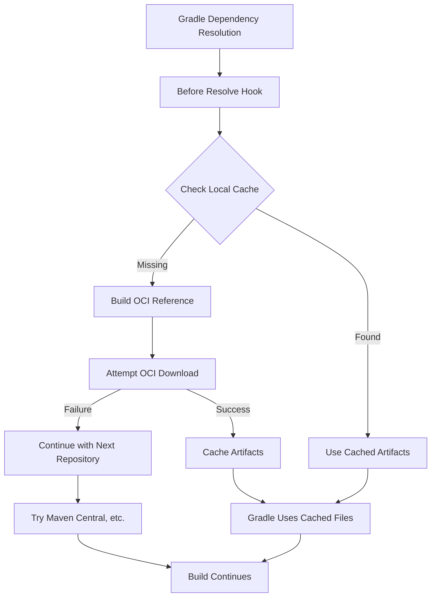

# Maven OCI Publish Plugin

A Gradle plugin that enables **bidirectional** Maven artifact management with OCI-compliant registries using the [ORAS (OCI Registry as Storage)](https://oras.land/) protocol.

## Features

- 📤 **Publish** Maven artifacts to OCI registries
- 📥 **Consume** Maven dependencies from OCI registries  
- 🔄 Seamless integration with existing Gradle repositories
- 📂 Local caching for performance and offline access
- 🔐 Authentication support (username/password)
- 🗂️ Intelligent Maven ↔ OCI coordinate mapping

## Requirements

- **Gradle 6.0+**
- **Java 17+** (required by ORAS Java SDK)
- Network access to OCI registries

## Installation

```gradle
plugins {
    id 'java'
    id 'maven-publish'  // Required for publishing
    id 'io.seqera.maven-oci-publish' version 'x.x.x'
}
```

## Get Started

### 📥 Consuming Dependencies from OCI

Add OCI repositories to your `repositories` block:

```gradle
repositories {
    mavenCentral()  // Fallback for standard dependencies
    
    oci("myRegistry") {
        url = 'https://registry.example.com/maven'
    }
}

dependencies {
    implementation 'com.example:my-library:1.0.0'  // Resolves from OCI if available
}
```

### 📤 Publishing to OCI Registries

Configure publishing with the `oci` extension:

```gradle
publishing {
    publications {
        maven(MavenPublication) {
            from components.java
        }
    }
}

oci {
    publications {
        maven {
            from components.java
        }
    }
    
    repositories {
        myRegistry {
            url = 'https://registry.example.com'
            namespace = 'maven'
            credentials {
                username = 'user'
                password = 'pass'
            }
        }
    }
}
```

Then publish:
```bash
./gradlew publishToOciRegistries
```

## Maven ↔ OCI Coordinate Mapping and Resolution

The Maven OCI Publish Plugin enables storing and retrieving Maven artifacts in OCI (Open Container Initiative) registries using the ORAS (OCI Registry as Storage) protocol. This requires a systematic mapping between Maven's coordinate system and OCI's naming conventions.

### Coordinate Mapping

Maven uses a three-part coordinate system:
```
groupId:artifactId:version
```

For example:
- `com.example:my-library:1.0.0`
- `org.springframework:spring-core:5.3.21`
- `io.seqera.nextflow:nextflow-core:22.04.0`

OCI registries use a hierarchical naming system:
```
registry.com/namespace/repository:tag
```

### Mapping Algorithm

The plugin maps Maven coordinates to OCI references using the following algorithm:

1. **Registry Base**: Use the configured registry URL as the base
2. **Group Sanitization**: Transform the Maven `groupId` to be OCI-compliant
3. **Repository Path**: Combine sanitized group and `artifactId`
4. **Tag**: Use the Maven `version` as the OCI tag

#### Complete Mapping Formula
```
Maven: groupId:artifactId:version
OCI:   registry.com/[namespace/]sanitized-groupId/artifactId:version
```

### Group ID Sanitization Rules

Maven group IDs often contain characters that are not valid in OCI repository names. The sanitization process applies these transformations:

1. **Case Normalization**: Convert to lowercase
   - `Com.Example` → `com.example`

2. **Dot Replacement**: Replace dots with hyphens for Docker compatibility
   - `com.example` → `com-example`

3. **Invalid Character Removal**: Keep only alphanumeric, dots, hyphens, underscores
   - `com.example@version` → `com-exampleversion`
   - `group/with/slashes` → `groupwithslashes`

4. **Separator Consolidation**: Replace consecutive separators with single hyphens
   - `com..example` → `com-example`
   - `mixed.-._.separators` → `mixed-separators`

5. **Trimming**: Remove leading and trailing separators
   - `.com.example.` → `com-example`

6. **Safety Prefix**: Add "g" prefix if result starts with hyphen or underscore (handled by cleanup)
   - `-example` → `example` (separators are removed)

### Mapping Examples

| Maven Coordinate | Sanitized Group | OCI Reference |
|------------------|-----------------|---------------|
| `com.example:my-lib:1.0.0` | `com-example` | `registry.com/com-example/my-lib:1.0.0` |
| `org.springframework:spring-core:5.3.21` | `org-springframework` | `registry.com/org-springframework/spring-core:5.3.21` |
| `io.seqera.nextflow:nextflow-core:22.04.0` | `io-seqera-nextflow` | `registry.com/io-seqera-nextflow/nextflow-core:22.04.0` |
| `Com.EXAMPLE.Test:artifact:1.0` | `com-example-test` | `registry.com/com-example-test/artifact:1.0` |
| `com.fasterxml.jackson.core:jackson-core:2.13.0` | `com-fasterxml-jackson-core` | `registry.com/com-fasterxml-jackson-core/jackson-core:2.13.0` |

### Namespace Support

OCI registries often use namespaces to organize repositories. The plugin supports namespaces in two ways:

1. **URL Path Namespace**: Embedded in the registry URL
   ```gradle
   oci("myRegistry") {
       url = 'https://registry.com/my-namespace'
   }
   ```
   Result: `registry.com/my-namespace/sanitized-group/artifact:version`

2. **Explicit Namespace**: Configured separately (for publishing)
   ```gradle
   repositories {
       docker {
           url = 'https://registry.com'
           namespace = 'my-namespace'
       }
   }
   ```
   Result: `registry.com/my-namespace/sanitized-group/artifact:version`

## Resolution Process

### Dependency Resolution Flow

When Gradle resolves dependencies that might be available in OCI registries, the following process occurs:



### Detailed Resolution Steps

1. **Hook Installation**: When an OCI repository is configured, the plugin installs hooks into Gradle's dependency resolution system.

2. **Resolution Trigger**: Before Gradle resolves dependencies, the `beforeResolve` hook is triggered for each configuration.

3. **Dependency Analysis**: For each dependency in the configuration:
   - Extract `groupId`, `artifactId`, and `version`
   - Check if artifacts already exist in the local cache

4. **Cache Check**: Look for artifacts in the local cache directory:
   ```
   PROJECT_ROOT/.gradle/oci-cache/REPOSITORY_NAME/groupId/artifactId/version/
   ```

5. **OCI Resolution** (if not cached):
   - Build OCI reference using the mapping algorithm
   - Create ORAS registry client with appropriate authentication
   - Attempt to pull the artifact from the OCI registry
   - If successful, organize files in Maven repository structure

6. **File Organization**: Downloaded artifacts are organized as:
   ```
   cache/groupId/artifactId/version/
   ├── artifactId-version.jar
   ├── artifactId-version.pom
   ├── artifactId-version-sources.jar    (if available)
   └── artifactId-version-javadoc.jar    (if available)
   ```

7. **POM Generation**: If no POM file is included in the OCI artifact, a minimal POM is generated with basic metadata.

8. **Gradle Integration**: Gradle continues its normal resolution process using the cached files as if they came from a standard Maven repository.

### Error Handling and Fallbacks

The resolution process is designed to be resilient:

- **Network Failures**: Logged but don't break the build
- **Authentication Issues**: Fall back to anonymous access if possible
- **Missing Artifacts**: Continue with other repositories in the chain
- **Invalid OCI References**: Skip and try other sources
- **Registry Unavailable**: Gracefully degrade to other repositories

### Caching Strategy

The plugin uses a sophisticated caching strategy:

- **Location**: `PROJECT_ROOT/.gradle/oci-cache/REPOSITORY_NAME/`
- **Persistence**: Survives `gradle clean` operations
- **Structure**: Standard Maven repository layout
- **Performance**: Cached artifacts are reused across builds
- **Cleanup**: Temporary download directories are cleaned up promptly

### Performance Considerations

- **Parallel Resolution**: Multiple dependencies can be resolved concurrently
- **Incremental Downloads**: Only missing artifacts are downloaded
- **Connection Reuse**: Registry connections are reused when possible
- **Timeout Handling**: Reasonable timeouts prevent hanging builds
- **Selective Resolution**: Only attempts OCI resolution for configured repositories

## Plugin Tasks

The plugin creates the following tasks:

### Publishing Tasks
- `publishToOciRegistries` - Publishes all publications to all OCI repositories
- `publish<Publication>To<Repository>Repository` - Publishes specific publication to specific repository
  - Example: `publishMavenPublicationToMyRegistryRepository`

### Standard Gradle Tasks
The plugin integrates with standard Gradle publishing:
- `publish` - Publishes to all configured repositories (Maven + OCI)
- `publishToMavenLocal` - Local Maven repository publishing
- All standard `maven-publish` plugin tasks

## Authentication

### Username/Password
```gradle
oci("registry") {
    url = 'https://registry.example.com'
    credentials {
        username = 'user'
        password = 'password'
    }
}
```

### Environment Variables
```gradle
oci("registry") {
    url = 'https://registry.example.com'
    credentials {
        username = System.getenv('REGISTRY_USERNAME')
        password = System.getenv('REGISTRY_PASSWORD')
    }
}
```

## Advanced Configuration

### Insecure Registries (HTTP)
```gradle
oci("localDev") {
    url = 'http://localhost:5000'
    insecure = true
}
```

### Multiple Registries
```gradle
repositories {
    oci("internal") {
        url = 'https://internal.company.com/maven'
        credentials { /* ... */ }
    }
    
    oci("public") {
        url = 'https://public.registry.com/maven'
    }
    
    mavenCentral()  // Fallback
}
```

### Custom Namespace
```gradle
oci {
    repositories {
        custom {
            url = 'https://registry.com'
            namespace = 'my-org/maven-artifacts'
        }
    }
}
```

## Configuration Examples

### Consumer Configuration

```gradle
repositories {
    mavenCentral()
    
    // Public OCI registry
    oci("seqeraPublic") {
        url = 'https://public.cr.seqera.io/maven'
    }
    
    // Private registry with authentication
    oci("companyPrivate") {
        url = 'https://registry.company.com/maven'
        credentials {
            username = project.findProperty('registryUser')
            password = project.findProperty('registryPass')
        }
    }
    
    // Local development registry
    oci("localDev") {
        url = 'http://localhost:5000'
        insecure = true
    }
}

dependencies {
    implementation 'com.company:internal-lib:1.0.0'  // Tries OCI first
    implementation 'org.springframework:spring-core:5.3.21'  // Falls back to Maven Central
}
```

### Publisher Configuration

```gradle
oci {
    publications {
        maven {
            from components.java
        }
    }
    
    repositories {
        dockerHub {
            url = 'https://registry-1.docker.io'
            namespace = 'maven'
            credentials {
                username = System.getenv('DOCKER_USERNAME')
                password = System.getenv('DOCKER_PASSWORD')
            }
        }
    }
}
```

## Best Practices

1. **Group ID Design**: Use consistent, hierarchical group IDs that sanitize well
2. **Registry Organization**: Use namespaces to organize different types of artifacts
3. **Authentication**: Use environment variables or Gradle properties for credentials
4. **Fallback Strategy**: Always include Maven Central or other standard repositories
5. **Cache Management**: Monitor cache sizes and clean up if necessary
6. **Network Configuration**: Configure appropriate timeouts for your network environment

## Known Limitations

- **Authentication**: Currently supports username/password only (no OAuth, tokens, or Docker credential helpers)
- **Repository Creation**: Requires container registries that allow creating arbitrary nested repositories on-demand (not all registries support this)
- **Metadata**: POM files may be generated if not included in OCI artifacts
- **Transitive Dependencies**: Only direct artifacts are cached; transitive dependency metadata relies on generated POMs
- **Parallel Downloads**: OCI resolution is sequential (no parallel downloads)
- **Error Recovery**: Failed OCI resolutions require cache cleanup for retry
- **Registry Features**: No support for OCI registry-specific features (signatures, attestations, etc.)

## Troubleshooting

### Debug Logging
Enable debug logging to see detailed resolution information:
```bash
./gradlew build --debug
```

This will show:
- OCI reference generation
- Cache hit/miss information
- Network requests and responses
- Error details and stack traces

### Clear Cache
```bash
rm -rf .gradle/oci-cache/
```

### Common Issues

1. **Sanitization Problems**: Check how your group ID is being sanitized
2. **Authentication Failures**: Verify credentials and registry permissions
3. **Network Issues**: Check connectivity to the OCI registry
4. **Cache Corruption**: Delete the cache directory and rebuild
5. **Network connectivity**: Check firewall and proxy settings  
6. **Dependency not found**: Verify OCI reference mapping

## Examples

Working examples in [`example/`](example/):
- [`example/publisher/`](example/publisher/) - Publishing artifacts
- [`example/consumer/`](example/consumer/) - Consuming dependencies

```bash
# Test publisher
cd example/publisher && ./gradlew publishToOciRegistries --dry-run

# Test consumer
cd example/consumer && ./gradlew run
```

## License

Licensed under the Apache License 2.0. See [LICENSE](LICENSE) for details.

## Acknowledgments

- [ORAS Java SDK](https://github.com/oras-project/oras-java) - OCI Registry as Storage
- Inspired by [oras-maven-plugin](https://github.com/Tosan/oras-maven-plugin)
